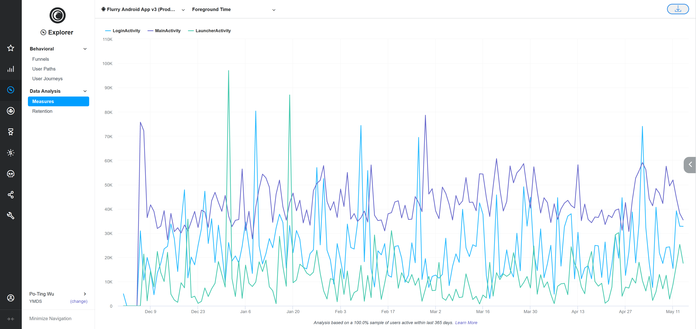
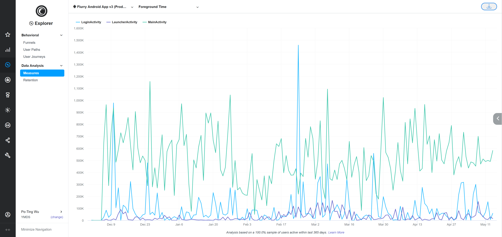

# Flurry Performance Metrics Tutorial

- [Introduction](#introduction)
- [Create a project for Flurry](#create-a-project-for-flurry)
  - [Build and run the Flurry Performance Metrics sample app](#build-and-run-the-flurry-performance-metrics-sample-app)
- [Flurry Performance Metrics APIs](#flurry-performance-metrics-apis)
  - [SDK APIs](#sdk-apis)
- [Setup Flurry Performance Metrics for project](#setup-flurry-performance-metrics-for-project)
  - [Cold Start](#cold-start)
     - [Investigate Cold Start Metrics from the Flurry Web UI](#investigate-cold-start-metrics-from-the-flurry-web-ui)
  - [Screen Time](#screen-time)
     - [Investigate App Screen Usage from the Flurry Web UI](#investigate-app-screen-usage-from-the-flurry-web-ui)
     - [Investigate App Screen Traverse from the Flurry Web UI](#investigate-app-screen-traverse-from-the-flurry-web-ui)
     - [Investigate App Screen Resume/Layout Time from the Flurry Web UI](#investigate-app-screen-resumelayout-time-from-the-flurry-web-ui)
  - [Foreground / Background Time](#foreground--background-time)
     - [Investigate Foreground / Background Time from the Flurry Web UI](#investigate-foreground--background-time-metrics-from-the-flurry-web-ui)
  - [HTTP/S Network Request](#https-network-request)
     - [Investigate HTTP/S Network Request Time from the Flurry Web UI](#investigate-https-network-request-time-from-the-flurry-web-ui)
  - [Resource Logger](#resource-logger)
     - [Investigate Resource Logger Metrics from the Flurry Web UI](#investigate-resource-logger-metrics-from-the-flurry-web-ui)
- [Collecting Control Remotely by Flurry Config](#collecting-control-remotely-by-flurry-config)
- [Flurry Performance Metrics Events and Parameters](#flurry-performance-metrics-events-and-parameters)
- [Support](#support)
- [License](#license)

The Flurry Performance Metrics Sample app guide walks you through the steps involved in integrating Flurry Performance Metrics APIs into your Android app. To learn more about the Flurry Performance Metrics API for Android, see [com.flurry.android.FlurryPerformance](http://flurry.github.io/flurry-android-sdk/analytics/com/flurry/android/FlurryPerformance.html).

# Introduction

Flurry Performance Metrics is to help developers understand how their app performs on the range of devices.

The SDK could capture app Performance Metrics without explicit changes to the app or integration code.

# Create a project for Flurry

If you already have a Flurry Analytics project, you may skip these steps.

Set up your project using the instructions provided in [Integrate Flurry SDK for Android](https://developer.yahoo.com/flurry/docs/integrateflurry/android/).

1.  Create an App & Get Your API Key
2.  Add the following dependency to your app module's build.gradle:

    ```groovy
    implementation 'com.flurry.android:analytics:12.3.0'
    ```

3.  Use `FlurryAgent.Builder` to initialize the Flurry SDK with your project's API key.

    ```java
    new FlurryAgent.Builder().build(this, FLURRY_API_KEY);
    ```

## Build and run the Flurry Performance Metrics sample app

1.  Download the Performance-Metrics-Tutorial.

    ```bash
    git clone git@github.com:flurry/Performance-Metrics-Tutorial .
    ```

2.  Open Android Studio.
3.  Select **File** > **Open**, browse to where you extracted the sample code, and then open the `Performance-Metrics-Tutorial` folder.
4.  Build and run the sample app.
    
    > You will need to replace with your own created Flurry API Key in your sample app in order to collect the performance data.

# Flurry Performance Metrics APIs

The available Performance Metrics provided by the Flurry SDK:

-   Cold Start - Resume/Layout/FullyDrawn *(time and memory)*
-   Screen Time - Resume/Layout Time
-   Foreground / Background Time
-   HTTP/S Network Request *(response code, redirect url, and time)*
-   Resources Logger *(time and memory)*

## SDK APIs

-   Cold Start / Screen Time / Foreground Time

    ```java
    new FlurryAgent.Builder()
         .withPerformanceMetrics(FlurryPerformance.COLD_START | FlurryPerformance.SCREEN_TIME)
         .build(this, FLURRY_APIKEY);

    FlurryPerformance.reportFullyDrawn();
    ```
    
-   HTTP/S Network Request

    - Option#1 (**HTTP EventListener.Factory**):

      ```java
      OkHttpClient client = new OkHttpClient.Builder()
           .eventListenerFactory(new FlurryPerformance.HttpEventListener.Factory("MyEventListener"))
           .build();
      ```

    - Option#2 (**HTTP EventListener**):

      ```java
      OkHttpClient client = new OkHttpClient.Builder()
           .eventListener(new FlurryPerformance.HttpEventListener("MyEventListener"))
           .build();
      ```

    - Option#3 (**HTTP Interceptor**):

      ```java
      OkHttpClient client = new OkHttpClient.Builder()
           .addInterceptor(new FlurryPerformance.HttpInterceptor("MyInterceptor"))
           .build();
      ```

    - Option#4 (**HTTP Logger for okhttp3**):

      ```java
      FlurryPerformance.HttpLogger logger = new FlurryPerformance.HttpLogger();
      okhttp3.Response response = chain.proceed(request);
      logger.logEvent("MyLogger", request, response);
      ```

    - Option#5 (**HTTP Logger for HttpURLConnection**):

      ```java
      FlurryPerformance.HttpLogger logger = new FlurryPerformance.HttpLogger();
      HttpURLConnection connection = (HttpURLConnection) url.openConnection();
      ...
      logger.logEvent("MyLogger", connection.getURL().toString(), connection.getResponseCode(), connection.getURL().toString());
      ```

-   Resources Logger

    ```java
    FlurryPerformance.ResourceLogger logger = new FlurryPerformance.ResourceLogger();
    … // codes to measure
    logger.logEvent("MyLogger");
    ```

# Setup Flurry Performance Metrics for project

The purpose of this section is to demonstrate the capabilities of Flurry Performance Metrics as well as provide a brief tutorial on the use of the Flurry Performance Metrics APIs.

## Cold Start

Measure the app’s starting time from scratch; evaluate the time taken when the first screen resumed, and when the screen laid out and responsive. And provide an API for app developers to manually define the fully drawn point.
 
Metrics supported:

-   Resume Time / Runtime Memory / System Memory
-   Layout Time / Runtime Memory / System Memory
-   Fully Drawn Time / Runtime Memory / System Memory

**Note**: *Runtime Memory* is the memory usage on the app's Java Virtual Machine, and *System Memory* is the available memory reduced on the device system.

|  |
|:---:|
| *Ref: <https://developer.android.com/topic/performance/vitals/launch-time> Digital Image* |

To enable Cold Start performance metrics:

```java
new FlurryAgent.Builder()
     .withPerformanceMetrics(FlurryPerformance.COLD_START)
     .build(this, FLURRY_APIKEY);
```

To report Cold Start fully drawn:

```java
FlurryPerformance.reportFullyDrawn();
```

### Investigate Cold Start Metrics from the Flurry Web UI

1.  From the **Explorer** tab, select **Measures** under Data Analysis
2.  Select **application**: e.g., Flurry Android App, and add **new query**
3.  Metrics:
    -   Select the **Metric** to display: Event Parameter - Numeric - Sum, Avg, etc...
    -   Select the **Operator**: Average Per Event
    -   Select the **Event**: Flurry.ColdStartTime
    -   Select the **Event Parameter**: (fl.resume.time / fl.layout.time / fl.fully.drawn.time / fl.resume.runtime.memory / fl.layout.runtime.memory / fl.fully.drawn.runtime.memory / fl.resume.system.memory / fl.layout.system.memory / fl.fully.drawn.system.memory)

      Add Constraint:
      -   **Event Parameter**: fl.layout.time
      -   **less than**
      -   **Event Parameter Value**: 60000
4.  X-Axis:
    -   **Device Model**: 40
5.  User Filter:
    -   **Install Date**: across all time
6.  Session Filters:
    -   **Session Date**: within the last / 365 days


- For the X-Axis, there are several available options you can choose based on your interests. E.g., App Version, OS Version, Session Date/Time, ...
- You can add Constraint to filter out the extreme high or low data.

## Screen Time

Time Spent per App Screen: Provide insights to the app developers how users traverse the app without requiring them to instrument the app with the custom events.

Metrics supported:

-   Resume Time
-   Layout Time
-   Current Screen / Previous Screen
-   Duration

To enable Screen Time performance metrics:

```java
new FlurryAgent.Builder()
     .withPerformanceMetrics(FlurryPerformance.SCREEN_TIME)
     .build(this, FLURRY_APIKEY);
```

### Investigate App Screen Usage from the Flurry Web UI

1.  From the **Analytics** tab, select **Event Details** under Events
2.  Add the event you are interested: e.g.,
    -   Flurry Android App
    -   Flurry.ScreenTime: MainActivity, Flurry.ScreenTime: MetricsActivity, ...


- From the Event Details view, you can investigate how each screen has been visited, how long they stayed, ... by your app's users.

### Investigate App Screen Traverse from the Flurry Web UI

1.  From the **Analytics** tab, select **Event Distribution** under Events
    -   **application**: e.g., Flurry Android App
    -   **event with parameters**: e.g., Flurry.ScreenTime: MainActivity
    -   **event parameter**: fl.previous.screen
2.  **CHART TYPE**: BAR


- From the Event Distribution view, you can research how your app's users navigate among various screens in your app.
- Traversing from the same screen a lot! Probably the UI design caused the screen to rotate too much, ...

### Investigate App Screen Resume/Layout Time from the Flurry Web UI

1.  From the **Explorer** tab, select **Measures** under Data Analysis
2.  Select **application**: e.g., Flurry Android App, and add **new query**
3.  Metrics:
    -   Select the **Metric** to display: Event Parameter - Numeric - Sum, Avg, etc...
    -   Select the **Operator**: Average Per Event
    -   Select the **Event**: e.g., Flurry.ScreenTime: MainActivity
    -   Select the **Event Parameter**: (fl.resume.time / fl.layout.time)
4.  X-Axis:
    -   **Session Date/Time**: days


- You can measure resume or layout time for each screen you are interested in, with various X-Axis selections.

## Foreground / Background Time

Active and Idle time per App Screen: Provide insights to the app developers how the individual screen is in the active foreground state or the idle background state.

Metrics supported:

-   Current Screen
-   Foreground Time
-   Background Time

To enable Foreground / Background Time performance metrics (same flag as Screen Time):

```java
new FlurryAgent.Builder()
     .withPerformanceMetrics(FlurryPerformance.SCREEN_TIME)
     .build(this, FLURRY_APIKEY);
```

### Investigate Foreground / Background Time Metrics from the Flurry Web UI

1.  From the **Explorer** tab, select **Measures** under Data Analysis
2.  Select **application**: e.g., Flurry Android App, and add **new query**
3.  Metrics:
    -   Select the **Metric** to display: Event Parameter - Numeric - Sum, Avg, etc...
    -   Select the **Operator**: Average Per Event
    -   Select the **Event**: Flurry.ForegroundTime
    -   Select the **Event Parameter**: (fl.foreground.time / fl.background.time)

      Add Constraint:
      -   **Event Parameter**: fl.foreground.time
      -   **less than**
      -   **Event Parameter Value**: 600000
4.  X-Axis:
    -   **Session Date/Time**: days
5.  Breakout:
    -   **Event Parameter**
    -   **Event**: Flurry.ForegroundTime
    -   **Event Parameter**: fl.current.screen
    -   **List Values**
    -   **Event Parameter Values**: e.g., MainActivity, Login Activity, ... for individual activity.

Foreground Time (breakout 3 activities):



Background Time (breakout 3 activities):



- You can select only the screens you are interested in by Breakout option.
- You can add Constraint to filter out the extreme high values especially for the Background time.
- You can investigate how long each screen has been visited and stayed. Is it too long, too short, or never?

## HTTP/S Network Request

Flurry SDK logs HTTP **response code**, **redirect url**, and the **total time**. For the EventListener API, it measures the following times as well:

-   **Total time**
-   **Redirect Time** (time before the final request)
-   **DNS Lookup time** (time between dns-lookup start and dns-lookup end)
-   **Connect time** (time between connect start and connect end)
-   **Response time** (time between the request sent and response start)
-   **Transfer time** (time between the request sent and response end)

|  |
|:---:|
| *Ref: <https://square.github.io/okhttp/events> Digital Image* |

To measure HTTP/S Network metrics:

- Option#1 (**HTTP EventListener.Factory**):

  ```java
  OkHttpClient client = new OkHttpClient.Builder()
       .eventListenerFactory(new FlurryPerformance.HttpEventListener.Factory("MyEventListener"))
       .build();
  ```

- Option#2 (**HTTP EventListener**):

  ```java
  OkHttpClient client = new OkHttpClient.Builder()
       .eventListener(new FlurryPerformance.HttpEventListener("MyEventListener"))
       .build();
  ```

- Option#3 (**HTTP Interceptor**):

  ```java
  OkHttpClient client = new OkHttpClient.Builder()
       .addInterceptor(new FlurryPerformance.HttpInterceptor("MyInterceptor"))
       .build();
  ```

- Option#4 (**HTTP Logger for okhttp3**):

  ```java
  FlurryPerformance.HttpLogger logger = new FlurryPerformance.HttpLogger();
  okhttp3.Response response = chain.proceed(request);
  logger.logEvent("MyLogger", request, response);
  ```

- Option#5 (**HTTP Logger for HttpURLConnection**):

  ```java
  FlurryPerformance.HttpLogger logger = new FlurryPerformance.HttpLogger();
  HttpURLConnection connection = (HttpURLConnection) url.openConnection();
  ...
  logger.logEvent("MyLogger", connection.getURL().toString(), connection.getResponseCode(), connection.getURL().toString());
  ```

### Investigate HTTP/S Network Request Time from the Flurry Web UI

1.  From the **Explorer** tab, select **Measures** under Data Analysis
2.  Select **application**: e.g., Flurry Android App, and add **new query**
3.  Metrics:
    -   Select the **Metric** to display: Event Parameter - Numeric - Sum, Avg, etc...
    -   Select the **Operator**: Average Per Event
    -   Select the **Event**: Flurry.HTTPRequestTime
    -   Select the **Event Parameter**: (fl.total.time / fl.redirect.time / fl.dns.time / fl.connect.time / fl.response.time / fl.transfer.time)
4.  X-Axis:
    -   **Session Date/Time**: days
5.  Breakout:
    -   **Event Parameter**
    -   **Event**: Flurry.HTTPRequestTime
    -   **Event Parameter**: fl.id
    -   **List Values**
    -   **Event Parameter Values**: e.g., id1, id2, ... for individual CDN servers, or urls.

HTTP/S Network Request Total Time (breakout 4 CDN servers):


HTTP/S Network Request DNS Time (breakout 4 CDN servers):


HTTP/S Network Request Connect Time (breakout 4 CDN servers):


HTTP/S Network Request Transfer Time (breakout 4 CDN servers):


- For this example, we group each server with a different ID. Therefore we can use the Breakout option to show them together in the same chart, and compare their performance.
- You can use the provided HTTP Event Listener options to collect more time metrics besides the total time.
- All of these event listeners and interceptors are reusable for measuring different tasks. Start time will be reset for each network request.

## Resource Logger

A logger that allows you to create a logger instance at the beginning of your interested code block, then log a performance event when this block ends. Flurry SDK will record the consumption of both CPU time and Memory usage.

Metrics supported:

-   Resource time
-   Resource Runtime memory *(memory usage on the apps's Java Virtual Machine)*
-   Resource System memory *(the available memory reduced on the device system)*

To measure Resource Logger metrics:

```java
FlurryPerformance.ResourceLogger logger = new FlurryPerformance.ResourceLogger();
… // codes to measure
logger.logEvent("MyLogger");
```

### Investigate Resource Logger Metrics from the Flurry Web UI

1.  From the **Explorer** tab, select **Measures** under Data Analysis
2.  Select **application**: e.g., Flurry Android App, and add **new query**
3.  Metrics:
    -   Select the **Metric** to display: Event Parameter - Numeric - Sum, Avg, etc...
    -   Select the **Operator**: Average Per Event
    -   Select the **Event**: Flurry.ResourceLog
    -   Select the **Event Parameter**: (fl.resource.time / fl.resource.runtime.memory / fl.resource.system.memory)
4.  X-Axis:
    -   **OS Version**: 20
5.  Breakout:
    -   **Device Model**: 20

Resource Time (breakout device model):


Resource Runtime Memory (breakout device model):


- Combine the X-Axis (e.g., OS Version) with the Breakout (e.g., Device Model) can describe the metrics in more detail.
- Runtime memory usage is measured on the app's Java Virtual Machine can be more useful than the System memory consumption.
- The logger instances are reusable for measuring different tasks. The start time will not be reset, hence the time measured is accumulated.

# Collecting Control Remotely by Flurry Config

App developers can use Flurry Config to control performance metrics collection remotely without the need to wait for the next app version release.

I.e., by default, if apps do not define the key-value in their Flurry Config variants, all performance metrics will be collected. Apps developers can define the values of `Flurry_PerformanceFlags` in their Config variants with `Resource|HTTP` (case insensitive) to enable or disable the specific performance collection.

**Note**: Cold Start and Screen Time cannot be disabled remotely.

```java
{ "Flurry_PerformanceFlags", "Resource|HTTP" }  enable Resource and HTTP metrics
{ "Flurry_PerformanceFlags", "Resource" }       enable Resource metrics
{ "Flurry_PerformanceFlags", "HTTP" }           enable HTTP metrics
{ "Flurry_PerformanceFlags", "" }               disable all metrics
```

# Flurry Performance Metrics Events and Parameters

Here is the list of Flurry Performance metrics events and parameters that you will need to refer when investigating on the Flurry Web UI.

**Cold Start**

```json
Cold Start event:         "Flurry.ColdStartTime"
Resume Time param:                "fl.resume.time"
Resume Runtime Memory param:      "fl.resume.runtime.memory"
Resume System Memory param:       "fl.resume.system.memory"
Layout Time param:                "fl.layout.time"
Layout Runtime Memory param:      "fl.layout.runtime.memory"
Layout System Memory param:       "fl.layout.system.memory"
Fully-Drawn Time param:           "fl.fully.drawn.time"
Fully-Drawn Runtime Memory param: "fl.fully.drawn.runtime.memory"
Fully-Drawn System Memory param:  "fl.fully.drawn.system.memory"
```

**Screen Time**

```json
Screen Time event:        "Flurry.ScreenTime: $ScreenName"
Current Screen param:             "fl.current.screen"
Previous Screen param:            "fl.previous.screen"
Duration param:                   "fl.duration"
Resume Time param:                "fl.resume.time"
Layout Time param:                "fl.layout.time"
```

**Foreground / Background Time**

```json
Foreground Time event:    "Flurry.ForegroundTime"
Current Screen param:             "fl.current.screen"
Foreground Time param:            "fl.foreground.time"
Background Time param:            "fl.background.time"
```

**HTTP/S Network Request**

```json
HTTP/S Logging event:     "Flurry.HTTPRequestTime"
ID param:                         "fl.id"        // for grouping
Request URL param:                "fl.request.url"
Response Code param:              "fl.response.code"
Response URL param:               "fl.response.url"
Total Time param:                 "fl.total.time"
Redirect Time param:              "fl.redirect.time"
DNS Lookup Time param:            "fl.dns.time"
Connect Time param:               "fl.connect.time"
Response Time param:              "fl.response.time"
Total Transfer Time param:        "fl.transfer.time"
```

**Resource Logger**

```json
Resource Logger event:    "Flurry.ResourceLog"
ID param:                         "fl.id"        // for grouping
Resource Time param:              "fl.resource.time"
Resource Runtime Memory param:    "fl.resource.runtime memory"
Resource System Memory param:     "fl.resource.system memory"
```

# Support

- [Flurry Developer Support Site](https://developer.yahoo.com/flurry/docs/)

# License

Copyright 2020, Verizon Media.

Licensed under the Apache License, Version 2.0 (the "License");
you may not use this file except in compliance with the License.
You may obtain a copy of the License at

  http://www.apache.org/licenses/LICENSE-2.0

Unless required by applicable law or agreed to in writing, software
distributed under the License is distributed on an "AS IS" BASIS,
WITHOUT WARRANTIES OR CONDITIONS OF ANY KIND, either express or implied.
See the License for the specific language governing permissions and
limitations under the License.

